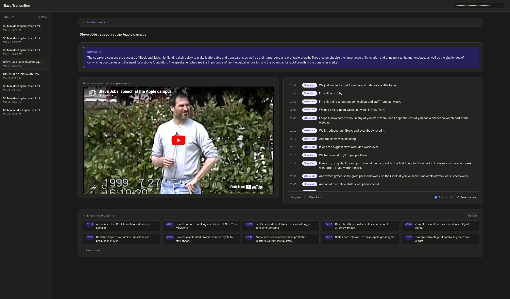

# Easy Transcriber



A self-hosted transcription web app powered by [Deepgram Nova-3](https://deepgram.com). Transcribe audio/video files, YouTube and podcast URLs, or live microphone input, all via a browser. Runs in Docker, intended for local hosting.

Built with the help of Claude over an evening, this is designed as a minimal alternative to Krisp or Otter.ai that costs pennies on the dollar and doesn’t force you into storing video recordings onto limited cloud storage. This also doesn’t tax the GPU as it’s running via an API. (If you’re a journalist, you might find this tool super-useful.)

Not sure if this is for you? Feel free to kick the tires—Deepgram offers new users $200 of free usage for testing, which will cover about 50 hours of recording. If you choose to add [DeepSeek](https://www.deepseek.com/), the cost is likewise minimal.

(NOTE: Deepgram is pretty solid, but like every other audio-to-text tool, not perfect. Double-check your work. It might miss something important.)

## Features

- **File upload** — MP3, MP4, MOV, WAV, M4A, FLAC, OGG, MKV up to 2 GB
    - Audio extracted from files to minimize size, but local copy of video can be reattached.
- **URL transcription** — YouTube, podcasts, and anything [yt-dlp](https://github.com/yt-dlp/yt-dlp) supports
- **Live transcription** — real-time streaming with speaker diarization; choose from mic only, system audio only, or mic + system as separate speaker tracks
- **Screen video recording** — optionally record your screen alongside any live session; saved with the transcript for playback sync. Compressed to 480p by default (toggleable per recording).
- **Keyterms support** — add up to 100 comma-separated keywords to the upload, allowing for accurate detection of proper nouns or jargon-laden terms
- **Dual-stream mode** — capture mic and system audio simultaneously as separate speakers
- **Interesting moments** — AI-powered topic extraction highlights the best moments (optional, requires DeepSeek key)
- **Transcript history** — sidebar with playback sync; click any word to jump to that moment
- **Custom speaker names** — Speakers can be edited by hand and selected from a list of prior speakers; transcriptions can also be reset as needed.
- **Export** — copy to clipboard or download as `.txt`
- **Light/dark mode**

## Prerequisites

- [Docker](https://docs.docker.com/get-docker/) with Compose
- A [Deepgram API key](https://console.deepgram.com/) (free tier available with up to $200 of usage for new users)

## Setup

**Quick start (no clone needed):**

```bash
# 1. Create a project folder
mkdir easy-transcriber && cd easy-transcriber

# 2. Download the compose file and example env
curl -O https://raw.githubusercontent.com/readtedium/easy-transcriber/main/docker-compose.yml
curl -O https://raw.githubusercontent.com/readtedium/easy-transcriber/main/.env.example
cp .env.example .env
# Edit .env and set DEEPGRAM_API_KEY

# 3. Initialize data directories
mkdir -p media uploads data

# 4. Start (pulls pre-built image automatically)
docker compose up
```

**Or clone and build locally:**

```bash
git clone https://github.com/readtedium/easy-transcriber
cd easy-transcriber
cp .env.example .env
# Edit .env and set DEEPGRAM_API_KEY
mkdir -p media uploads data
docker compose up --build
```

Open [http://localhost:3000](http://localhost:3000) in your browser.

> **No .env?** You can leave `DEEPGRAM_API_KEY` blank and paste your key directly into the UI instead. It's stored in browser `localStorage` and sent with each request.

## Configuration

Copy `.env.example` to `.env`:

```env
DEEPGRAM_API_KEY=   # Required for transcription
DEEPSEEK_API_KEY=   # Optional — enables "Interesting Moments" topic extraction
SERVER_PORT=3000    # Port to expose on the host (default: 3000)
LOGIN_PASSWORD=     # Optional — enables password protection
SESSION_SECRET=     # Recommended when LOGIN_PASSWORD is set; random string
```

## Usage

**Subsequent starts** (after first build):
```bash
docker compose up
```

**After editing server-side files** (`server.js`, `Dockerfile`):
```bash
docker compose down && docker compose up --build
```

**After editing frontend files** (`public/`):
Just hard-refresh the browser — no restart needed.

## Live Transcription

The **Live mic** tab streams audio to Deepgram in real time. Use the audio source selector to choose between:

- **Mic only** — microphone input
- **System audio only** — whatever is playing on your computer (useful for transcribing calls or videos you're watching)
- **Mic + System** — both simultaneously, each assigned to a separate speaker track

> System audio capture uses the browser's `getDisplayMedia` API. You'll be prompted to share a tab or window; for system audio modes, make sure to enable audio capture in that prompt.

### Screen video recording

Check **Record screen video** before starting a session to save a screen recording alongside the transcript. This is available in all audio modes — in mic-only mode it records the screen without capturing system audio. The recording is saved with the transcript and syncs to the playback timeline.

Video is compressed to 480p by default to keep file sizes manageable. Uncheck **Compress to 480p** before recording if you want the full resolution.

## Interesting Moments

When a `DEEPSEEK_API_KEY` is set, Transcriber automatically analyzes each transcript after it finishes and surfaces 10–20 notable timestamps with short labels. You can regenerate these at any time with the **Refresh** button.

## Running without Docker

> **Note:** Docker is the easier path and avoids the setup below. Consider it first.

You'll need Node.js 20+, `ffmpeg`, `yt-dlp`, and native build tools for `better-sqlite3`.

**ffmpeg**

| Platform | Command |
|----------|---------|
| macOS | `brew install ffmpeg` |
| Ubuntu/Debian | `sudo apt install ffmpeg` |
| Fedora | `sudo dnf install ffmpeg` |
| Arch | `sudo pacman -S ffmpeg` |
| Windows | [ffmpeg.org/download](https://ffmpeg.org/download.html) or `winget install ffmpeg` |

**yt-dlp** (required for URL transcription)

| Platform | Command |
|----------|---------|
| macOS | `brew install yt-dlp` |
| Ubuntu/Debian | `sudo apt install yt-dlp` or `pip install yt-dlp` |
| Fedora | `sudo dnf install yt-dlp` or `pip install yt-dlp` |
| Arch | `sudo pacman -S yt-dlp` |
| Windows | `winget install yt-dlp` or `pip install yt-dlp` |

**Native build tools** (for `better-sqlite3`):

- **macOS**: `xcode-select --install`
- **Ubuntu/Debian**: `sudo apt install build-essential python3-dev`
- **Fedora**: `sudo dnf install gcc-c++ make python3-devel`
- **Arch**: `sudo pacman -S base-devel python`
- **Windows**: [Visual Studio Build Tools](https://visualstudio.microsoft.com/visual-cpp-build-tools/) (select "Desktop development with C++")

Then:

```bash
npm install
cp .env.example .env  # add your API key
mkdir -p media uploads data
node server.js
```

## Notes

- **Authentication is optional.** Set `LOGIN_PASSWORD` in `.env` to enable a password-protected login page. Sessions last 7 days. Set `SESSION_SECRET` to a random string to keep sessions valid across restarts; if omitted, a new secret is generated each restart (logging everyone out). Generate one with: `node -e "console.log(require('crypto').randomBytes(32).toString('hex'))"`. For exposing to the internet, [Tailscale](https://tailscale.com) or Cloudflare Access are stronger alternatives with no login-page attack surface.
- Transcript history is stored in a SQLite database (`transcripts.db`). The `media/` directory holds saved audio files. Both are mounted as Docker volumes so data persists across restarts. If upgrading from an older version, `history.json` will be automatically migrated on first boot.
- URL transcriptions are not saved to `media/` (audio is downloaded, transcribed, then deleted).

## Roadmap

- Look into additional transcription engines (Whisper, Moonshine Voice)
- Add alternatives to DeepSeek (Claude, Ollama, ChatGPT)
- Download YouTube closed captions as a fallback option

## License

MIT
